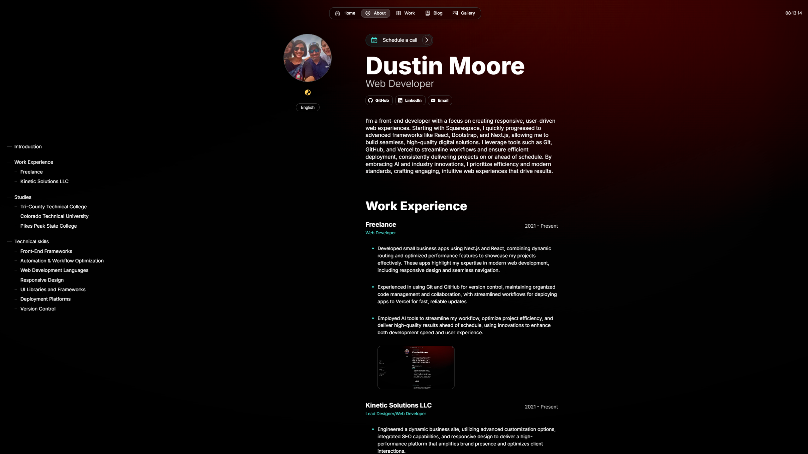
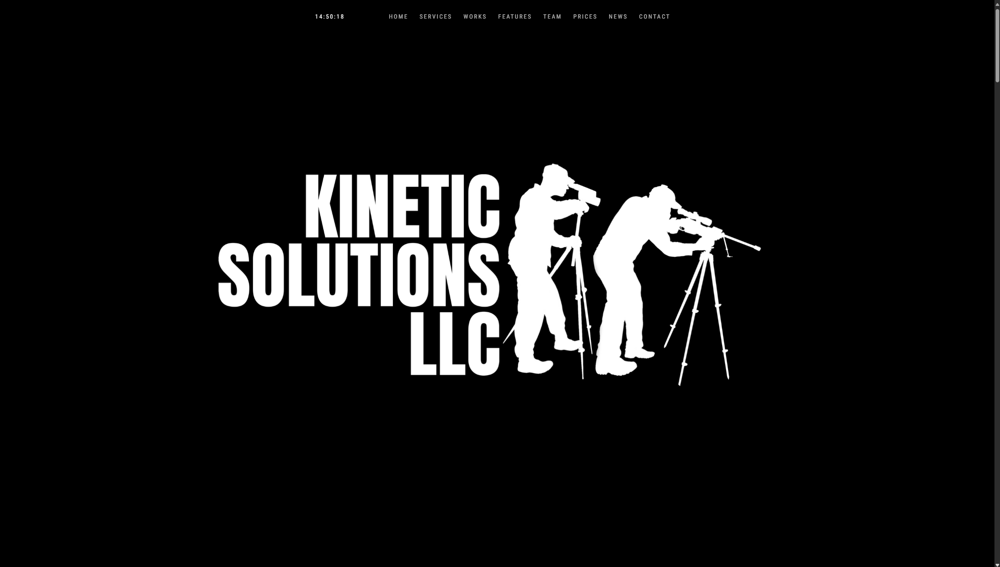

  
  
 #

---

## 🚀 About Me
I’m a front-end developer with a focus on creating responsive, user-driven web experiences. Starting with Squarespace, I quickly progressed to advanced frameworks like React, Bootstrap, and Next.js, allowing me to build seamless, high-quality digital solutions. I leverage tools such as Git, GitHub, and Vercel to streamline workflows and ensure efficient deployment, consistently delivering projects ahead of schedule. By embracing AI and industry innovations, I prioritize efficiency and modern standards, crafting engaging, intuitive web experiences that drive results.

---

## 🛠️ Technologies & Tools
 

  
  
  
  
  
  
  
  
  

 

---

## 🌟 My Projects

  <h3>Personal Portfolio Website</h3>
  
A showcase of my portfolio, built with React, Next.js, Typescript for responsive design.

  

    
  

  
<a href="https://github.com/dustinmmoore/magic-portfolio">🔗 View Project</a>

 

  <h3>Dynamic Business Website (Under Construction)</h3>
  
Kinetic Solutions LLC revamp powered by Bootstrap and Javascript.

  

    
  

  
<a href="https://github.com/dustinmmoore/library">🔗 View Project</a>

 

---

## 📊 GitHub Stats & Activity

  
  
  
  

---

## 🤝 Let's Connect

  
  
  

---
