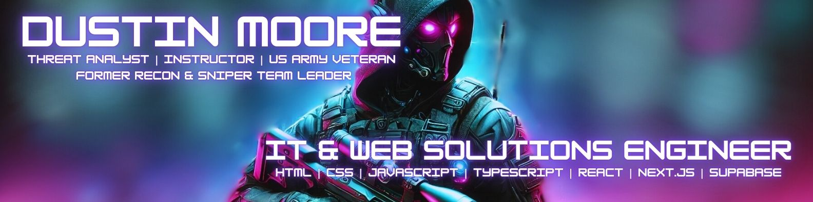

  

 

  
  

 

---

## About Me
Hi! I’m Dustin, a detail-oriented IT and Web Solutions Engineer with over five years of experience in technical support, system troubleshooting, and IT infrastructure management. Since 2021, I’ve specialized in web development, designing responsive, user-friendly websites using modern frameworks. My combined expertise in IT and web development enables me to deliver seamless, efficient, and reliable digital solutions tailored to meet diverse needs.

---

## Technologies & Tools
 

  
  
  
  
  
  
  
  
  

