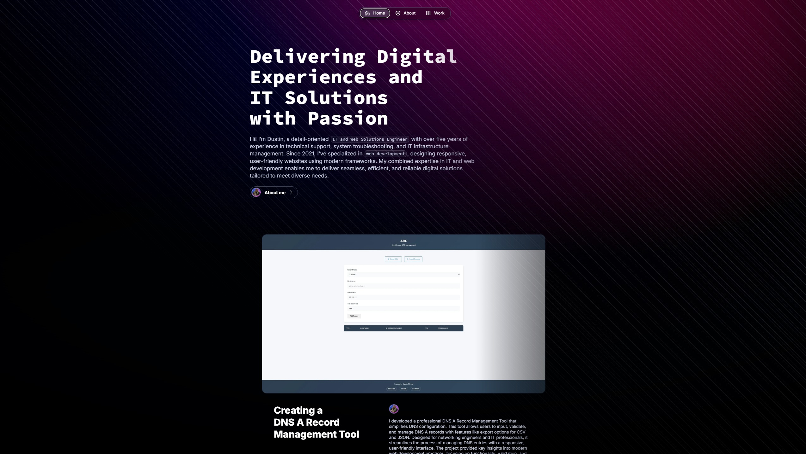

  

 

  
  
  

 

---

## 🚀 About Me
I’m a full-stack developer specializing in responsive, user-focused web experiences. Starting with Squarespace, I quickly advanced to frameworks like React, Bootstrap, and Next.js, along with Node.js for back-end development, allowing me to build seamless, high-quality digital solutions from end to end. I use tools like Git, GitHub, and Vercel to optimize workflows and ensure efficient deployment, consistently delivering projects on time. By embracing AI and modern technologies, I prioritize efficiency and industry standards, crafting intuitive, engaging web experiences that drive results.

---

## 🛠️ Technologies & Tools
 

  
  
  
  
  
  
  
  
  

 

---

## 🌟 My Projects

  <h3>Personal Portfolio Website</h3>
  
A showcase of my portfolio, built with React, Next.js, and Typescript for responsive design.

  

    
  

  

    
  

  

    
  

  

    
  

  

    
  

    
<a href="https://github.com/dustinmmoore/magic-portfolio">🔗 View Project</a>

  

  <h3>Dynamic Business Website</h3>
  
Kinetic Solutions LLC revamp powered by Bootstrap 5 and  Vanilla Javascript.

  

    
  

  

    
  

  

    
  

  

    
  

  

    
  

  

    
  

  
<a href="https://github.com/dustinmmoore/kineticsolutionsllc">🔗 View Project</a>

---

