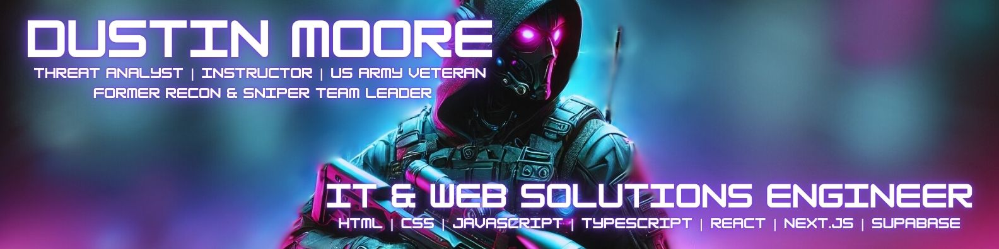

  

 

  
  

 

  

---

## About Me
Hi! I'm Dustin, the **Founder and Lead Developer** of [Vibixel](https://vibixel.com), a South Carolina-based digital agency dedicated to transforming businesses through high-performance websites, professional photography, and advanced AI tools.

With over five years of experience in custom website design and development, I specialize in creating clean, modern sites that are both visually appealing and user-friendly across all devices. My focus is on clear structure, strong visuals, and intuitive navigation to ensure visitors know exactly where to go and what to do next.

I work with modern web frameworks and technologies to build responsive, fast, and reliable websites that capture attention, build trust, and convert visitors into customers. Every project is crafted with attention to detail and a commitment to delivering exceptional results.

---

## Technologies & Tools

 

  
  
  
  
  
  
  

